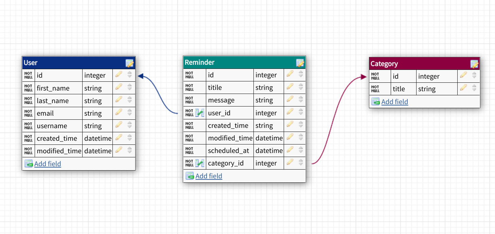

# Remindpo
A minimal app to manage your events

### DB Schema




##Easy setup with Run the Dockerfile

```
docker-compose build
```

## or Run the project without Docker 🤷‍♂️
#  Setup Guide, step by step:
## Clone the  Repository


## Create a Python Virtual Environment
```python3.10 -m venv venv``` 

## Install the Packages
```pip install -r requirements.txt```


## Create your database
### Open your postgresql shell with ```psql``` command

### Create Database
```sql
CREATE DATABASE <database_name>;
```

### Create User
```sql
CREATE USER <username>;
```

### Grant all privileges to remindpo database user
```sql
GRANT ALL PRIVILEGES ON DATABASE <database_name> TO <username>;
```

### Create a Password for your remindpo database user
```sql
ALTER USER user_name WITH PASSWORD '<password>';
```


## Create a `````.env````` file in root directory and add your created config:
```python
SECRET_KEY='Your Secret Key generated by https://djecrety.ir'
DEBUG= 'Status of debug of the proejct'
ALLOWED_HOSTS= ''

DB_NAME= '<user_name>'
DB_USER= '<password>'
DB_PASSWORD= '<database_name>'
DB_HOST='localhost'
DB_PORT=5432

EMAIL_HOST_USER= '<your_email_host_user'
EMAIL_HOST_PASSWORD = '<your_email_host_password'
```

### Migrate tables to the database
```python manage.py migrate```

